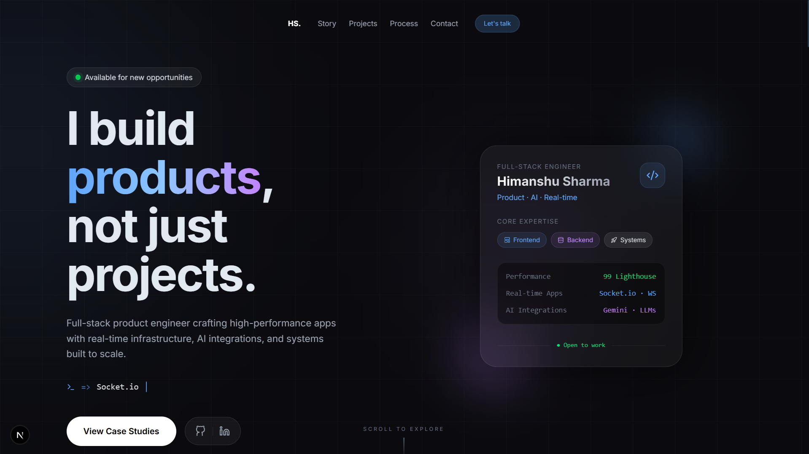

<p align="center">
  
</p>

<p align="center">
  
  
  
  
  
  
</p>

<h1 align="center">Himanshu Sharma — Portfolio</h1>

<p align="center">
  <strong>Full-Stack Product Engineer</strong> · Real-time Apps · AI Integrations · Scalable Systems
</p>

<p align="center">
  A cinematic, scroll-driven portfolio built with Next.js 16, featuring buttery-smooth Lenis scrolling, GSAP-powered transitions, featuring smooth animations, scroll interactions, and a modern glassmorphic UI
</p>

---

## ✨ Highlights

| Feature | Details |
|---|---|
| **Smooth Scrolling** | Lenis + GSAP ScrollTrigger for a 60fps cinematic feel |
| **Typewriter Hero** | Animated cycling keywords (Socket.io, Gemini AI, Next.js…) |
| **Mouse-tracking Glow** | Spring-physics cursor light that follows the user |
| **Project Showcase** | 3-column grid with hover overlays, case-study modals, and staggered reveals |
| **Interactive Skills** | Click-to-reveal proficiency cards with animated progress bars |
| **Build Pipeline** | 5-step workflow visualisation with connecting line and connector dots |
| **Proof of Work** | Animated count-up metrics (99 Lighthouse, 3+ shipped apps, etc.) |
| **Closing CTA** | Parallax-driven "Let's create something" section with gradient text |
| **Dark UI** | Glassmorphism, gradient overlays, and custom scrollbars throughout |

---

## 🏗️ Tech Stack

| Layer | Technology |
|---|---|
| **Framework** | [Next.js 16](https://nextjs.org/) (App Router, SSR) |
| **UI Library** | [React 19](https://react.dev/) |
| **Language** | [TypeScript 5](https://www.typescriptlang.org/) |
| **Styling** | [Tailwind CSS 4](https://tailwindcss.com/) with `@theme` design tokens |
| **Animation** | [Framer Motion 12](https://www.framer.com/motion/) + [GSAP 3](https://gsap.com/) + [Lenis](https://lenis.darkroom.engineering/) |
| **Icons** | [Lucide React](https://lucide.dev/) + custom SVG icons |
| **Utilities** | `clsx`, `tailwind-merge` |
| **Linting** | ESLint 9 + `eslint-config-next` |

---

## 📁 Project Structure

```
portfolio/
├── public/
│   └── images/               # Project screenshots (blogsphere, chucklr, whisperbox)
├── src/
│   ├── app/
│   │   ├── globals.css       # Tailwind @theme tokens, custom scrollbar, shimmer keyframes
│   │   ├── layout.tsx        # Root layout — Inter font, Lenis smooth-scroll wrapper
│   │   └── page.tsx          # Home page — composes all sections
│   ├── components/
│   │   ├── Hero.tsx           # Typewriter, mouse-glow, floating profile card
│   │   ├── StoryBridge.tsx    # Narrative transition between hero and timeline
│   │   ├── Timeline.tsx       # Journey timeline read from personal.md
│   │   ├── Projects.tsx       # Project grid + case-study modal (reads projects.md)
│   │   ├── HowIThink.tsx      # Engineering philosophy section
│   │   ├── Skills.tsx         # Interactive skill cards with proficiency bars
│   │   ├── BuildProcess.tsx   # 5-step build workflow pipeline
│   │   ├── ProofOfWork.tsx    # Animated count-up metrics + experience tags
│   │   ├── ClosingCTA.tsx     # Parallax CTA with gradient headline
│   │   ├── Contact.tsx        # Contact section (alternate)
│   │   ├── Navbar.tsx         # Navigation bar
│   │   ├── Philosophy.tsx     # Engineering philosophy (alternate)
│   │   ├── StoryJourney.tsx   # Story journey (alternate)
│   │   ├── SmoothScroll.tsx   # Lenis + GSAP ScrollTrigger integration
│   │   └── Icons.tsx          # Custom GitHub & LinkedIn SVG icons
│   └── lib/
│       ├── markdown.ts        # Parses personal.md & projects.md into typed data
│       └── utils.ts           # cn() helper (clsx + tailwind-merge)
├── personal.md                # Journey / story steps (sibling of portfolio/)
├── projects.md                # Project case-study data (sibling of portfolio/)
├── design.md                  # Design notes (sibling of portfolio/)
├── package.json
├── tsconfig.json
├── next.config.ts
├── postcss.config.mjs
└── eslint.config.mjs
```

---

## 🚀 Getting Started

### Prerequisites

- **Node.js** ≥ 18.18
- **npm** ≥ 9 (or yarn / pnpm)

### Installation

```bash
# 1 — Clone the repo
git clone https://github.com/himanshu7437/portfolio-2026
cd portfolio

# 2 — Install dependencies
npm install

# 3 — Start the dev server
npm run dev
```

The site will be available at **http://localhost:3000**.

### Data Files

Project and personal data are read at build-time from markdown files in the **parent directory** of `portfolio/`:

| File | Purpose |
|---|---|
| `../personal.md` | Journey phases displayed in the Timeline section |
| `../projects.md` | Case study data (title, problem, solution, tech, impact) |

Make sure these files exist before building.

---

## 📜 Available Scripts

| Command | Description |
|---|---|
| `npm run dev` | Start the development server (hot reload) |
| `npm run build` | Create an optimised production build |
| `npm run start` | Serve the production build locally |
| `npm run lint` | Run ESLint across the codebase |

---

## 🎨 Design System

The portfolio uses a custom dark-mode design system defined via Tailwind CSS `@theme` tokens in `globals.css`:

```css
@theme {
  --color-background: #0B0B0F;
  --color-foreground: #E2E8F0;
  --color-primary:    #60a5fa;    /* Blue-400 */
  --color-secondary:  #c084fc;    /* Purple-400 */
  --font-sans:        var(--font-inter);
}
```

### Typography
- **Primary Font**: [Inter](https://fonts.google.com/specimen/Inter) via `next/font/google`
- **Monospace**: System monospace for code snippets and labels

### Visual Effects
- **Glassmorphism**: `backdrop-blur-2xl` with semi-transparent borders
- **Gradient Text**: `bg-clip-text text-transparent` with primary → secondary gradients
- **Custom Scrollbar**: 4px thin scrollbar with primary accent colour
- **Shimmer Animation**: Infinite gradient sweep on section headings

---

## 🧩 Featured Projects

| Project | Description | Live |
|---|---|---|
| **BlogSphere** | Full-featured blogging platform with social profiles and rich-text editing | [↗ Live](https://appwriteblog-lac.vercel.app/) |
| **Chucklr** | Instagram-inspired social app with real-time feeds, messaging, and stories | [↗ Live](https://chucklr.vercel.app/) |
| **Whisperbox** | Anonymous messaging platform with AI-powered reply suggestions | [↗ Live](https://whisperbox-beta.vercel.app/) |

---

## 📂 Adding a New Project

1. **Add a block to `../projects.md`**:
   ```markdown
   ---
   ## ProjectName
   Problem:
   Description of the problem.
   Solution:
   How you solved it.
   Tech:
   React, Node.js, MongoDB
   Impact:
   Measurable outcome.
   ```

2. **Add a screenshot** to `public/images/projectname.png` (lowercase, no spaces).

3. **Register metadata** in `src/components/Projects.tsx` → `projectMeta` object with `description`, `liveUrl`, `githubUrl`, `color`, and `gradient`.

4. Restart the dev server — the new project will appear automatically.

---

## 🌐 Deployment

The portfolio is optimised for deployment on **Vercel**:

```bash
# Deploy with Vercel CLI
npx vercel
```

> **Note**: Since `markdown.ts` reads data from the parent directory at build time (`../*.md`), make sure your deployment environment includes these files or adjust the `dataDir` path in `src/lib/markdown.ts`.

---

## 🙌 Feedback

If you have any feedback, suggestions, or just want to connect — feel free to reach out!

---

## 📄 License

This project is private and not licensed for redistribution. All rights reserved © Himanshu Sharma.

---

<p align="center">
  <sub>Designed & built from scratch with ❤️ by <strong>Himanshu Sharma</strong></sub>
</p>
